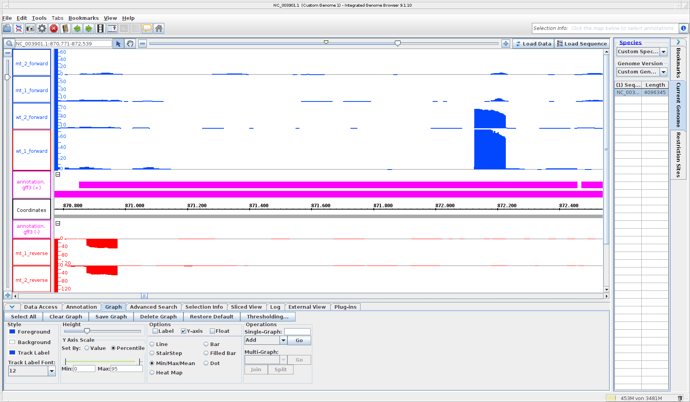
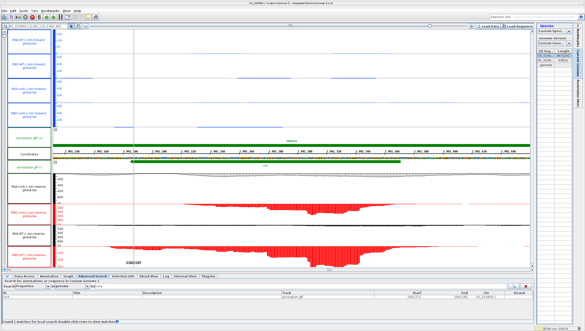

# Day 8 

Transcriptomics 

```

#!/bin/bash
#SBATCH --nodes=1
#SBATCH --cpus-per-task=32
#SBATCH --mem=64G
#SBATCH --time=0-04:00:00
#SBATCH --job-name=reademption_tutorial
#SBATCH --output=reademption_tutorial.out
#SBATCH --error=reademption_tutorial.err
#SBATCH --partition=base
#SBATCH --reservation=biol217

module load gcc12-env/12.1.0
module load miniconda3/4.12.0

#set proxy environment to download the data and use the internet in the backend
export http_proxy=http://relay:3128
export https_proxy=http://relay:3128
export ftp_proxy=http://relay:3128

conda activate reademption
# create folders
reademption create --project_path READemption_analysis --species salmonella="Salmonella Typhimurium"

# Download the files
FTP_SOURCE=ftp://ftp.ncbi.nih.gov/genomes/archive/old_refseq/Bacteria/Salmonella_enterica_serovar_Typhimurium_SL1344_uid86645/
wget -O READemption_analysis/input/salmonella_reference_sequences/NC_016810.fa $FTP_SOURCE/NC_016810.fna
wget -O READemption_analysis/input/salmonella_reference_sequences/NC_017718.fa $FTP_SOURCE/NC_017718.fna
wget -O READemption_analysis/input/salmonella_reference_sequences/NC_017719.fa $FTP_SOURCE/NC_017719.fna
wget -O READemption_analysis/input/salmonella_reference_sequences/NC_017720.fa $FTP_SOURCE/NC_017720.fna

#rename the files similar to the genome naming
sed -i "s/>/>NC_016810.1 /" READemption_analysis/input/salmonella_reference_sequences/NC_016810.fa
sed -i "s/>/>NC_017718.1 /" READemption_analysis/input/salmonella_reference_sequences/NC_017718.fa
sed -i "s/>/>NC_017719.1 /" READemption_analysis/input/salmonella_reference_sequences/NC_017719.fa
sed -i "s/>/>NC_017720.1 /" READemption_analysis/input/salmonella_reference_sequences/NC_017720.fa
wget -P READemption_analysis/input/salmonella_annotations https://ftp.ncbi.nlm.nih.gov/genomes/all/GCF/000/210/855/GCF_000210855.2_ASM21085v2/GCF_000210855.2_ASM21085v2_genomic.gff.gz

# unzip the file
gunzip READemption_analysis/input/salmonella_annotations/GCF_000210855.2_ASM21085v2_genomic.gff.gz
wget -P READemption_analysis/input/reads http://reademptiondata.imib-zinf.net/InSPI2_R1.fa.bz2
wget -P READemption_analysis/input/reads http://reademptiondata.imib-zinf.net/InSPI2_R2.fa.bz2
wget -P READemption_analysis/input/reads http://reademptiondata.imib-zinf.net/LSP_R1.fa.bz2
wget -P READemption_analysis/input/reads http://reademptiondata.imib-zinf.net/LSP_R2.fa.bz2

#read alignment
reademption align -p 4 --poly_a_clipping --project_path READemption_analysis

# read coverage
reademption coverage -p 4 --project_path READemption_analysis

# gene quantification
reademption gene_quanti -p 4 --features CDS,tRNA,rRNA --project_path READemption_analysis
reademption deseq -l InSPI2_R1.fa.bz2,InSPI2_R2.fa.bz2,LSP_R1.fa.bz2,LSP_R2.fa.bz2 -c InSPI2,InSPI2,LSP,LSP -r 1,2,1,2 --libs_by_species salmonella=InSPI2_R1,InSPI2_R2,LSP_R1,LSP_R2 --project_path READemption_analysis

# visualzation
reademption viz_align --project_path READemption_analysis
reademption viz_gene_quanti --project_path READemption_analysis
reademption viz_deseq --project_path READemption_analysis
conda deactivate
module purge
jobinfo

```

## Doing our own data 

```sh
module load gcc12-env/12.1.0
module load miniconda3/4.12.0
conda activate reademption

reademption create --project_path READemption_analysis --species metharnosarcina="Methanosarcina mazei"

conda activate /home/sunam226/.conda/envs/grabseq

#use micromamba to activate grabseq
module load micromamba/1.4.2
micromamba activate 10_grabseqs

# go the folder 
cd $HOME/.micromamba/envs/10_grabseqs/lib/python3.7/site-packages/grabseqslib/
#open sra.py file
#and replace the line 94 with the following one:
metadata = requests.get("https://trace.ncbi.nlm.nih.gov/Traces/sra-db-be/runinfo?acc="+pacc) 
#save it
micromamba deactivate 10_grabseqs
micromamba activate 10_grabseqs
#usegrabseqs now

grabseqs sra -t 12 SRR4018514 # wt_1
grabseqs sra -t 12 SRR4018515 # wt_2
grabseqs sra -t 12 SRR4018516 # mt_1
grabseqs sra -t 12 SRR4018517 # mt_2

```
Run fastqc 

```sh
mkdir ../qc_reports
mkdir ../qc_reports/fastqc output 
for i in *.fastq.gz; do fastqc -t 4 -o ../qc_reports/fastqc_output $i; done

```
```sh
for i in *.fastq.gz; do fastp -i $i -o ${i}_cleaned.fastq.gz -h ../qc_reports/${i}_fastp.html -j ${i}_fastp.json -w 4 -q 20 -z 4; done
```
```sh
## Final Script 

#!/bin/bash
#SBATCH --nodes=1
#SBATCH --cpus-per-task=32
#SBATCH --mem=64G
#SBATCH --time=0-04:00:00
#SBATCH --job-name=rna_seq_methanosarcina
#SBATCH --output=rna_seq_methanosarcina.out
#SBATCH --error=rna_seq_methanosarcina.err
#SBATCH --partition=base
#SBATCH --reservation=biol217

module load gcc12-env/12.1.0
module load miniconda3/4.12.0
conda activate reademption

## 1. create a directory for the analysis
# reademption create --project_path READemption_analysis --species metanosarcina="Methanosarcina mazei Gö1"

#2- copy the sequences and files in respective directories
# download the sequences from the NCBI database or github folder named "genome_input"

#3- Processing and aligning the reads
reademption align --project_path READemption_analysis \
	--processes 32 --segemehl_accuracy 95 \
	--poly_a_clipping \
	--fastq --min_phred_score 25 \
	--progress

#4- Coverage
reademption coverage --project_path READemption_analysis \
	--processes 32

#5- Performing gene wise quantification
reademption gene_quanti --project_path READemption_analysis \
	--processes 32 --features CDS,tRNA,rRNA 

#6- Performing differential gene expression analysis 

####NOTE:: Change the names according to your file names in the READemption_analysis/input/reads/ directory
reademption deseq --project_path READemption_analysis \
	--libs wt_1.fastq.gz,wt_2.fastq.gz,mt_1.fastq.gz,mt_2.fastq.gz \
	--conditions wt,wt,mt,mt --replicates 1,2,1,2 \
	--libs_by_species metanosarcina=wt_1,wt_2,mt_1,mt_2

#7- Create plots 
reademption viz_align --project_path READemption_analysis
reademption viz_gene_quanti --project_path READemption_analysis
reademption viz_deseq --project_path READemption_analysis

# The whole command will take around 2 hours to run.
conda deactivate
module purge
jobinfo
```

## Looking at results 

Why Rpkm: single ends reads, not paired end reads 

What is tnoar: total number of aligned reads of the given library 

Volcano plots: Log2 fold change calculated based on RPKM, shows p-value 

Deseq calculates fold2change -> can see whether genes are up or downregulated 

5 Locus tags where wt is downregulated 

MM_RS00150: Mt is upregulated by -2.06 Yes
MM_RS04770: Mt is upregulated by -1.2 Yes
MM_RS05370: Mt is upregulated by -1.16 Yes
MM_RS07870: Mt is upregulated by -1.15 Yes
MM_RS05335: Mt is upregulated by -1.09 Yes

5 Locus tags where wt is upregulated

MM_RS03790: Mt is downregulated by 1.9 yes
MM_RS06645: Mt is downregulated by 1.71 ?
MM_RS00155: Mt is downregulated by 1.58 yes
MM_RS02310: Mt is downregulated by 1.3
MM_RS00765: Mt is downregulated by 1.23

Volcano plot of log2 fold change adjusted p-value mt vs wildtype


# Documentation and how to add image 


##
Find the ORF 

Startcodon: ATG at 2.991.370
Stoppcodon: TAA at 2.991.187
Länge in Aminosäuren: 62 AA with stopcodon, 61 AA
Shine dalgano Sequenz: AGGAG at -7 (G ist letztes Nukleotid bei -7)
Name des upstream gens: alaS STM14_3414
Do you think csrA is translated: Yes because of RIBO profile 


